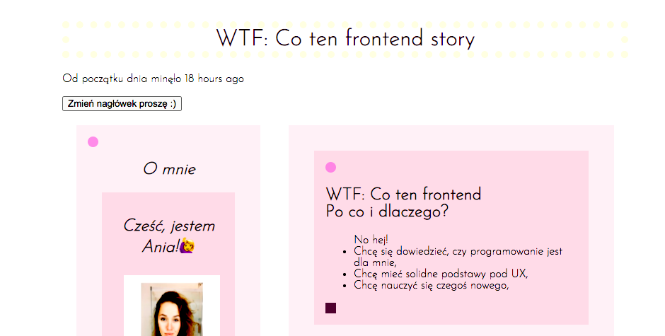

# My very first project 

Simple, ugly, but **my** first website created basing on *WTF co ten frontend* course.

## How to use it?

Just click and check how it works. Don't be scared - I checked the acquired knowledge on this project, so don't be surprised by the number of colors, effects and random code! 🙈

## Available scripts

`npm run start` - runs development mode

`npm run build` - runs build process for production

`npm run publish` - runs build process and publish the page using `gh-pages` branch

